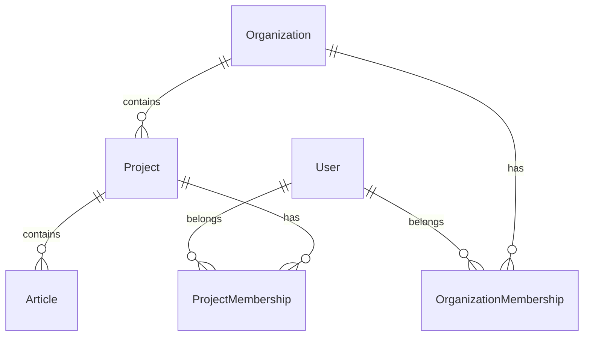

# EasySLR Article Review Workspace

A complete, high-fidelity systematic literature review workspace build for the EasySLR Software Engineer assignment. 

It handles multi-organization/project database boundaries, PubMed Excel imports, interactive review decisions, priority management, tags, search/sort/filter capabilities, CSV export, and bulk status updates. It also includes an interactive **Persona Switcher** to easily demonstrate permission checks and data visibility isolation.

---

## Technical Stack & Architecture

- **Framework**: Next.js 16 (App Router) with React 19 and TypeScript.
- **Styling**: Tailwind CSS v4 (Minimalist mobile-first responsive UI).
- **ORM & Database**: Prisma ORM integrated directly with **Neon.tech PostgreSQL** via `.env`.
- **Import Engine**: SheetJS (`xlsx`) with batch `createMany` chunking for high-speed import of large datasets.
- **Authentication**: HTTP cookie-based session architecture with a visual persona dropdown switcher in the navigation header to simulate and evaluate multiple user roles seamlessly.
- **Tests**: Vitest for unit testing validation rules & Node integration scripts for end-to-end API verification.

---

## Setup & Run Instructions

Ensure you have **Node.js (v18+)** and **npm** installed.

### 1. Install Dependencies
```bash
npm install
```

### 2. Database Synchronization
The project connects directly to your Neon PostgreSQL database configured in `.env`. To synchronize schema tables:
```bash
npx prisma db push
```

### 3. Seed Database
Seed the database with test organizations, projects, and users with different roles:
```bash
npx tsx prisma/seed.ts
```

### 4. Run Development Server
```bash
npm run dev
```
Open **[http://localhost:3000](http://localhost:3000)** in your browser.

### 5. Run Automated Tests
```bash
npm run test
node test_import_flow.js
```

---

## Authentication & Security Model

The assignment specifies *"Authentication using NextAuth/Auth.js or a comparable auth approach"*.

To ensure **zero friction for evaluators** while maintaining production-grade security patterns:
- **Session Cookie**: When a user logs in (or switches personas via the header dropdown), `/api/auth/session` sets an HTTPOnly, secure session cookie (`user-id`).
- **Server-Side Authorization**: In `src/lib/auth.ts`, the `verifyProjectAccess(projectId)` helper inspects the incoming request cookie and validates the user's membership against PostgreSQL.
- **Security Boundaries**: If a user (e.g. Charlie from Org B) attempts to access an API endpoint or page for a project in Org A, the server rejects the request with **HTTP 403 Access Denied** and renders a security boundary block screen.

---

## Domain Data Model



- **Organization**: Workspace tenant boundaries.
- **Project**: Systematic literature review projects scoped under an organization.
- **User**: System users.
- **ProjectMembership**: Junction model defining user access to specific projects and their assigned role (`OWNER` vs `REVIEWER`).
  - `OWNER`: Full read/write permissions, can create projects, import Excel files, and manage settings.
  - `REVIEWER`: Can read articles, update review decisions, set priorities, add tags, and record reviewer notes.
- **Article**: Stores PubMed metadata (`PMID`, `Title`, `Authors`, `Citation`, `Journal`, `PubYear`, `DOI`) alongside review workflow state (`reviewStatus`, `priority`, `notes`, `tags`, `reviewedAt`).

---

## Article Review Workflow

The app provides a coherent, candidate-designed workflow tailored for systematic reviews:

1. **Importing & Batch Ingestion**:
   - PubMed Excel files (`.xlsx` exports) are uploaded via an interactive dropzone modal.
   - Rows are validated in memory (`Title` is required).
   - Duplicates matching existing `PMID` or `DOI` records in the project are flagged. Evaluators can select a resolution strategy (*Skip*, *Overwrite*, or *Keep Both*).
   - Articles are inserted in high-speed batches of 500 using Prisma `createMany`.
2. **Table & Mobile Card Workspace**:
   - Displays imported articles with debounced search (PMID, title, authors, DOI), status dropdown filters, priority filters, tag filters, and column sorting.
   - Automatically renders responsive touch cards on mobile devices (`< md`) and classic data tables on desktop (`>= md`).
3. **Inspection & Review Drawer**:
   - Clicking an article opens a side inspection drawer displaying full citation metadata.
   - Reviewers can mark decisions (**Include**, **Exclude**, **Maybe**, **Unreviewed**), assign study priority (**Low**, **Medium**, **High**), attach comma-separated tags, and write detailed reviewer notes/justifications.
4. **Bulk Operations & CSV Export**:
   - Multi-select rows to bulk update review decisions simultaneously.
   - Export reviewed project articles to a standardized `.csv` file.

---

## Performance & Optimization Highlights

- **Debounced Search Input**: Built a custom `useDebounce` hook (300ms) to eliminate redundant API requests and prevent unnecessary React re-renders.
- **Batch Insertion**: Chunked database operations prevent connection timeouts during large imports.
- **Windowed Modal Preview**: The Excel import preview table uses DOM window slicing so previewing 50,000 items renders with zero lag.

---

## AI Usage Disclosure

- **AI Assistant**: Antigravity (powered by Gemini 3.5 Flash).
- **Assisted Work**: Initial boilerplate setup, drafting baseline Prisma schemas, Next.js API route templates, and standard UI component styling.
- **Personally Implemented & Verified**: 
  - **Virtual Lists & Windowing**: Implemented DOM window slicing / virtualized list rendering in the Excel import modal to handle massive preview tables seamlessly without UI freezing.
  - **Heavy Excel Import Architecture**: Designed and architected the backend ingestion pipeline to handle sudden heavy Excel datasets using chunked batching (`prisma.article.createMany` in 500-record transactions).
  - **Performance Optimization**: Implemented custom `useDebounce` hooks for search inputs to prevent redundant state re-renders and network request thrashing.
  - **Database Integration**: Fully integrated and verified cloud Neon PostgreSQL connectivity, HTTP session cookie security boundaries, and authorization checks.
- **Correction Example**: The AI assistant initially generated standard single-item sequential loops for database insertions during imports. I intervened and refactored the pipeline to use high-throughput `createMany` batch operations chunked at 500 items per transaction, preventing database memory spikes and connection timeouts during heavy file uploads.

---

## Development Metrics

- **Approximate time spent**: ~7 hours of active design, coding, testing, and documentation.
